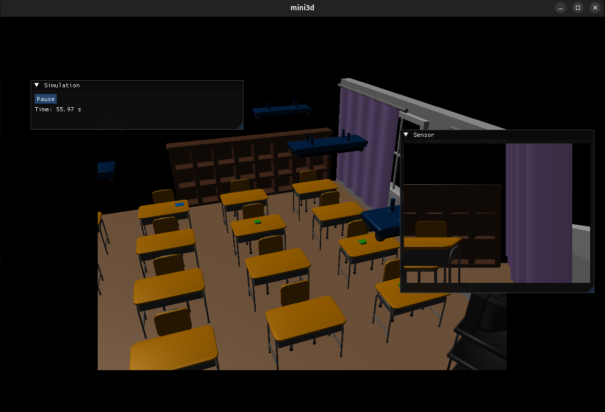

# mini3d

A **work-in-progress C++20/OpenGL visual sensor simulator** for computer vision and robotics experiments.

`mini3d` loads real 3D environments, configures virtual camera rigs from scenario files, replays trajectories, and renders calibrated sensor observations.

The project is being developed as a lightweight and extensible simulator rather than a general-purpose game engine. Its longer-term goal is to provide a practical environment for sensor simulation, computer vision experiments, visualization, recording, and evaluation against known simulator ground truth.



> **Status: Work in progress**
>
> `mini3d` is under active development. Core rendering, scene loading, calibrated cameras, RGB-D capture, configurable sensor rigs, trajectory replay, and an initial simulator UI are working. Recording, richer UI tools, additional sensor types, and complete CV workflows are still being developed.

---

## Current Features

### 3D Rendering

- C++20 codebase
- OpenGL 3.3 rendering pipeline
- glTF / GLB scene loading
- Hierarchical asset transforms
- Materials and textures
- Directional lighting
- Interactive free-view camera
- Offscreen framebuffer rendering
- Separate viewer and simulated sensor cameras

The simulator can load complete environments rather than requiring scenes to be constructed manually in C++.

---

## Scenario-Based Simulation

Worlds, sensor rigs, cameras, and trajectories are configured through JSON scenario files.

Example:

```json
{
  "world": "assets/worlds/classroom.glb",

  "rigs": [
    {
      "name": "robot",

      "pose": {
        "position": [0.0, 0.0, 0.0],
        "orientation": [1.0, 0.0, 0.0, 0.0]
      },

      "cameras": [
        {
          "name": "front_camera",

          "intrinsics": {
            "width": 800,
            "height": 600,
            "fx": 724.264,
            "fy": 724.264,
            "cx": 400.0,
            "cy": 300.0
          },

          "near": 0.1,
          "far": 100.0,

          "pose": {
            "position": [0.0, 1.2, 0.2],
            "orientation": [1.0, 0.0, 0.0, 0.0]
          }
        }
      ]
    }
  ],

  "trajectories": [
    {
      "name": "robot_path",
      "rig": "robot",

      "keyframes": [
        {
          "time": 0.0,
          "position": [0.0, 0.0, 0.0],
          "orientation": [1.0, 0.0, 0.0, 0.0]
        },

        {
          "time": 2.0,
          "position": [0.0, 0.0, -2.0],
          "orientation": [1.0, 0.0, 0.0, 0.0]
        }
      ]
    }
  ]
}
